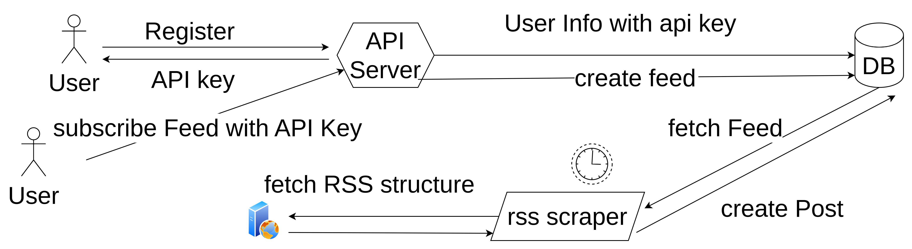

# golang-rss-sample

This repository is implementation RSS with golang sample

## tool use

1. sqlc for generate sql template

```shell
go install github.com/sqlc-dev/sqlc/cmd/sqlc@latest
```

2. goose for db migration

```shell
go install github.com/pressly/goose/v3/cmd/goose@latest
```

## develop flow for goose and sqlc

1. update sql schema

2. migrate sql schema change
  
3. write query sql 
   
4. generate model code

## architecture

